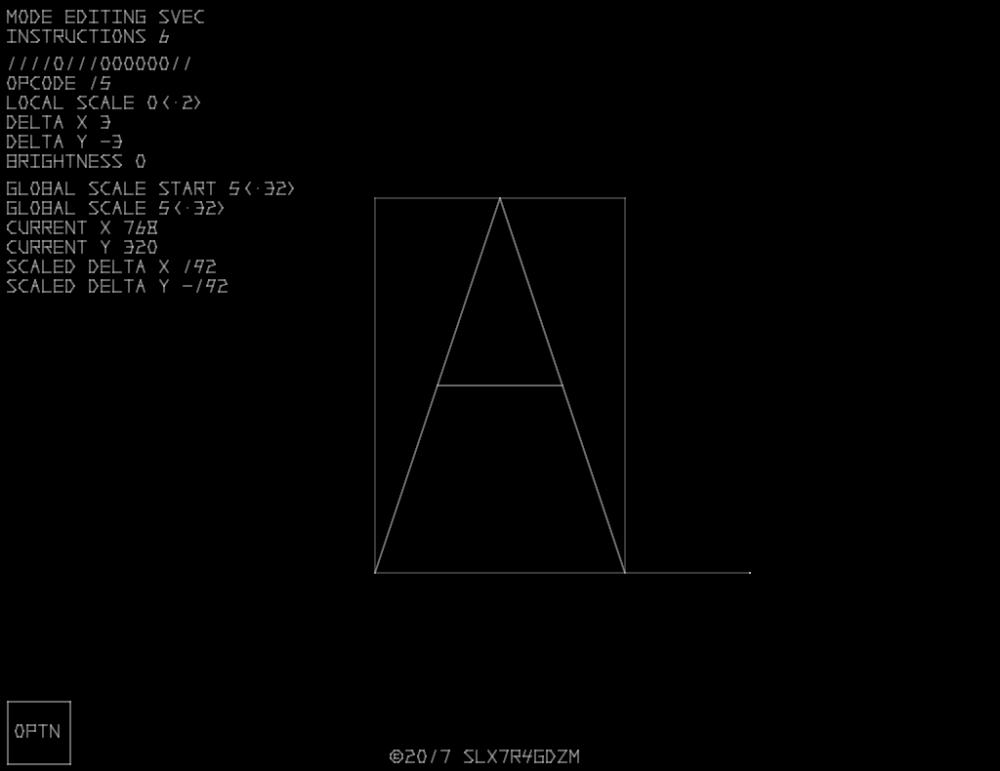
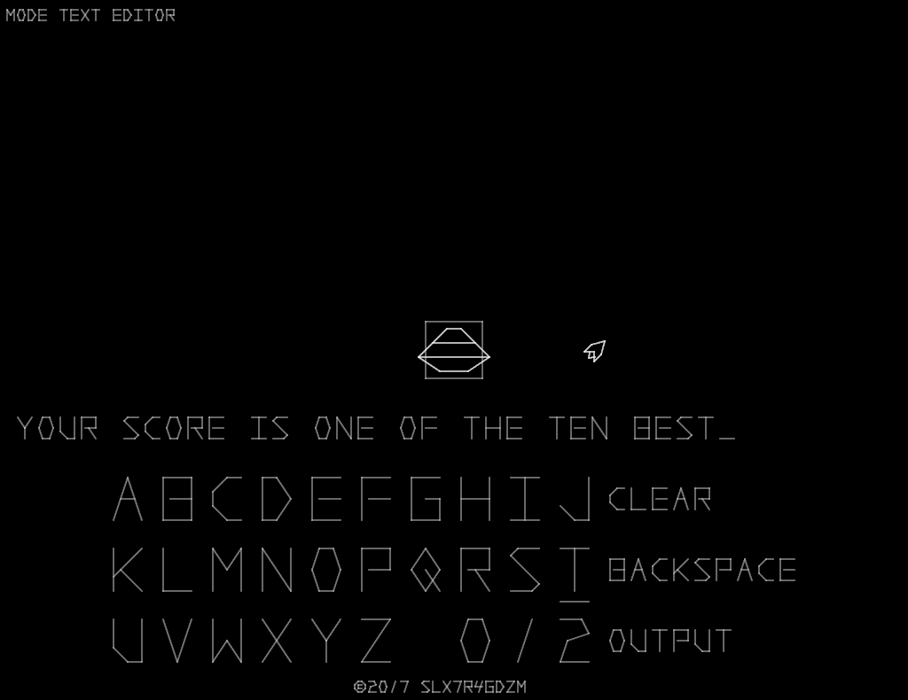

# Sine Toolkit
Sine Toolkit was made to help with the development of [Sine](https://github.com/slx7R4GDZM/Sine).

## Screenshots
| Vector object editor                                                                              | Text editor                                                                                    |
| ------------------------------------------------------------------------------------------------- | ---------------------------------------------------------------------------------------------- |
|  |  |

## Download
The compressed source and a prebuilt Windows binary can be found [here](https://github.com/slx7R4GDZM/Sine-Toolkit/releases).

## Default Controls
| Action     | Key            |
| ---------- | -------------- |
| Confirm    | <kbd>E</kbd>   |
| Cancel     | <kbd>F</kbd>   |
| Up         | <kbd>W</kbd>   |
| Down       | <kbd>S</kbd>   |
| Left       | <kbd>A</kbd>   |
| Right      | <kbd>D</kbd>   |
| Options    | <kbd>Q</kbd>   |
| Fullscreen | <kbd>F11</kbd> |
| Exit       | <kbd>Esc</kbd> |

## Compiling
Sine Toolkit was designed to compile with SFML 2.4.2 under MinGW-w64 7.1.0 POSIX Threads using the C++14 flag.

## License Information
This project is licensed under the terms of the [MIT License](License.txt).
SFML is licensed under the terms of the [zlib/png license](https://www.sfml-dev.org/license.php).
